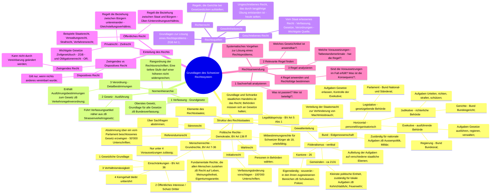

```mermaid
mindmap
  root((Grundlagen des Schweizer Rechtssystem))
    Struktur des Rechtsstaates
      Elemente des Rechtsstaates;
      Legalitätsprinzip - BV Art 5 Abs 1
        Grundlage und Schranke staatlichen Handelns ist das Recht; Behörden müssen sich an Gesetze halten;
      Gewaltenteilung
        Verteilung der Staatsmacht zur Verhinderung von Machtmissbrauch;
        Horizontal - personell/organisatorisch
          Legislative - gesetzgebende Behörde
            Parlament - Bund National- und Ständerat;
            Aufgaben Gesetze erlassen, Kontrolle der Exekutive;
          Exekutive - ausführende Behörde
            Regierung - Bund Bundesrat;
            Aufgaben Gesetze ausführen, regieren, verwalten;
          Judikative - richterliche Behörde
            Gerichte - Bund Bundesgericht;
            Aufgaben Urteilen, richten, strafen, schützen;
        Föderalismus - vertikal
          Aufteilung der Aufgaben auf verschiedene staatliche Ebenen;
          Bund - Eidgenossenschaft
            Zuständig für nationale Aufgaben zB Aussenpolitik, Militär;
          Kantone - 26
            Eigenständig - souverän - in den ihnen zugewiesenen Bereichen zB Schulwesen, Polizei;
          Gemeinden - ca 2131
            Kleinste politische Einheit, zuständig für lokale Aufgaben zB Kehrichtabfuhr, Feuerwehr;
      Menschenrechte - Grundrechte, BV Art 7-36
        Fundamentale Rechte, die allen Menschen zustehen zB Recht auf Leben, Meinungsfreiheit, Eigentumsgarantie;
        Einschränkungen - BV Art 36
          Nur unter 4 Voraussetzungen zulässig;
          1 Gesetzliche Grundlage
          2 Öffentliches Interesse / Schutz Dritter
          3 Verhältnismässigkeit
          4 Kerngehalt bleibt unberührt
      Politische Rechte - Demokratie, BV Art 136 ff
        Mitbestimmungsrechte für Schweizer Bürger ab 18, urteilsfähig;
        Wahlrecht
          Personen in Behörden wählen;
        Stimmrecht
          Über Sachfragen abstimmen;
        Initiativrecht
          Verfassungsänderung vorschlagen - 100'000 Unterschriften;
        Referendumsrecht
          Abstimmung über ein vom Parlament beschlossenes Gesetz erzwingen - 50'000 Unterschriften;
    Normenhierarchie
      Rangordnung der Rechtsvorschriften; Eine tiefere Stufe darf einer höheren nicht widersprechen;
      1 Verfassung - Grundgesetz
        Oberstes Gesetz, Grundlage für alle Gesetze zB Bundesverfassung;
      2 Gesetz - Ausführung
        Führt Verfassungsartikel näher aus zB Strassenverkehrsgesetz;
      3 Verordnung - Detailbestimmungen
        Enthält Ausführungsbestimmungen zum Gesetz zB Verkehrsregelnverordnung;
    Rechtsquellen
      Grundlagen zur Lösung eines Rechtsproblems - ZGB Art 1;
      Geschriebenes Recht
        Vom Staat erlassenes Recht - Verfassung, Gesetze, Verordnungen - Wichtigste Quelle;
      Gewohnheitsrecht
        Ungeschriebenes Recht, das durch langjährige Übung entstanden ist - heute selten;
      Richterrecht
        Regeln, die Gerichte bei Gesetzeslücken aufstellen;
    Einteilung des Rechts
      Öffentliches Recht
        Regelt die Beziehung zwischen Staat und Bürgern - Über-/Unterordnungsverhältnis;
        Beispiele Staatsrecht, Verwaltungsrecht, Strafrecht, Verfahrensrecht;
      Privatrecht - Zivilrecht
        Regelt die Beziehung zwischen Bürgern untereinander - Gleichstellungsverhältnis;
        Wichtigste Gesetze Zivilgesetzbuch - ZGB - und Obligationenrecht - OR;
      Zwingendes vs Dispositives Recht
        Zwingendes Recht
          Kann nicht durch Vereinbarung geändert werden;
        Dispositives Recht
          Gilt nur, wenn nichts anderes vereinbart wurde;
    Rechtsanwendung
      Systematisches Vorgehen zur Lösung eines Rechtsproblems;
      1 Sachverhalt analysieren
        Was ist passiert? Wer ist beteiligt?;
      2 Relevante Regel finden
        Welches Gesetz/Artikel ist anwendbar?;
      3 Regel analysieren
        Welche Voraussetzungen - Tatbestandsmerkmale - hat die Regel?;
      4 Regel anwenden und Rechtsfolge bestimmen
        Sind die Voraussetzungen im Fall erfüllt? Was ist die Konsequenz?;
```

