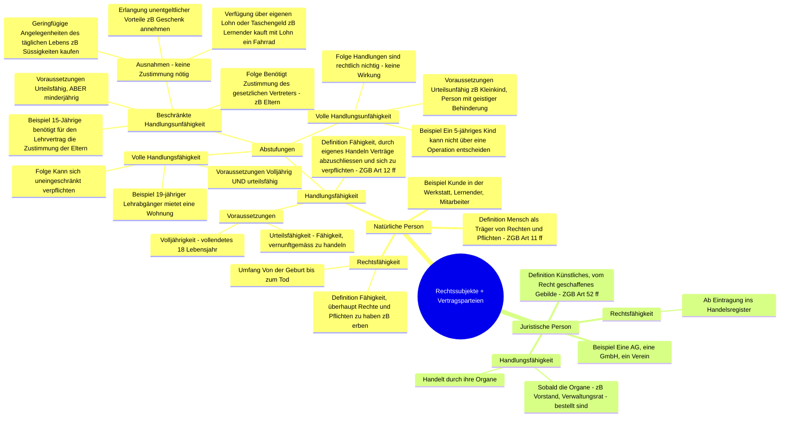

```mermaid
mindmap
  root((Rechtssubjekte + Vertragsparteien))
    Natürliche Person
      Definition Mensch als Träger von Rechten und Pflichten - ZGB Art 11 ff
      Beispiel Kunde in der Werkstatt, Lernender, Mitarbeiter
      Rechtsfähigkeit
        Definition Fähigkeit, überhaupt Rechte und Pflichten zu haben zB erben
        Umfang Von der Geburt bis zum Tod
      Handlungsfähigkeit
        Definition Fähigkeit, durch eigenes Handeln Verträge abzuschliessen und sich zu verpflichten - ZGB Art 12 ff
        Voraussetzungen
          Volljährigkeit - vollendetes 18 Lebensjahr
          Urteilsfähigkeit - Fähigkeit, vernunftgemäss zu handeln
        Abstufungen
          Volle Handlungsfähigkeit
            Voraussetzungen Volljährig UND urteilsfähig
            Folge Kann sich uneingeschränkt verpflichten
            Beispiel 19-jähriger Lehrabgänger mietet eine Wohnung
          Beschränkte Handlungsunfähigkeit
            Voraussetzungen Urteilsfähig, ABER minderjährig
            Folge Benötigt Zustimmung des gesetzlichen Vertreters - zB Eltern
            Beispiel 15-Jährige benötigt für den Lehrvertrag die Zustimmung der Eltern
            Ausnahmen - keine Zustimmung nötig
              Erlangung unentgeltlicher Vorteile zB Geschenk annehmen
              Geringfügige Angelegenheiten des täglichen Lebens zB Süssigkeiten kaufen
              Verfügung über eigenen Lohn oder Taschengeld zB Lernender kauft mit Lohn ein Fahrrad
          Volle Handlungsunfähigkeit
            Voraussetzungen Urteilsunfähig zB Kleinkind, Person mit geistiger Behinderung
            Folge Handlungen sind rechtlich nichtig - keine Wirkung
            Beispiel Ein 5-jähriges Kind kann nicht über eine Operation entscheiden
    Juristische Person
      Definition Künstliches, vom Recht geschaffenes Gebilde - ZGB Art 52 ff
      Beispiel Eine AG, eine GmbH, ein Verein
      Rechtsfähigkeit
        Ab Eintragung ins Handelsregister
      Handlungsfähigkeit
        Sobald die Organe - zB Vorstand, Verwaltungsrat - bestellt sind
        Handelt durch ihre Organe
```
