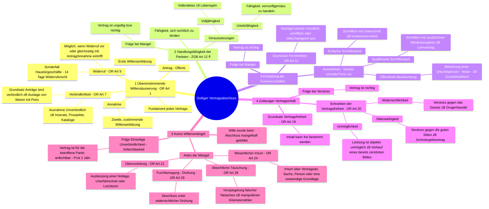

```mermaid
mindmap
  root((Gültiger Vertragsabschluss))
    1 Übereinstimmende Willensäusserung - OR Art 1
      Fundament jedes Vertrags
      Antrag - Offerte
        Erste Willenserklärung
      Annahme
        Zweite, zustimmende Willenserklärung
      Verbindlichkeit - OR Art 7
        Grundsatz Anträge sind verbindlich zB Auslage von Waren mit Preis
        Ausnahme Unverbindlich zB Inserate, Prospekte, Kataloge
      Widerruf - OR Art 9
        Möglich, wenn Widerruf vor oder gleichzeitig mit Antrag/Annahme eintrifft
        Sonderfall Haustürgeschäfte - 14 Tage Widerrufsrecht

    2 Handlungsfähigkeit der Parteien - ZGB Art 12 ff
      Fähigkeit, sich rechtlich zu binden
      Voraussetzungen
        Volljährigkeit
          Vollendetes 18 Lebensjahr
        Urteilsfähigkeit
          Fähigkeit, vernunftgemäss zu handeln
      Folge bei Mangel
        Vertrag ist ungültig bzw nichtig

    3 Einhaltung der Formvorschriften
      Grundsatz Formfreiheit - OR Art 11
        Verträge können mündlich, schriftlich oder stillschweigend sein
      Ausnahmen - Gesetz schreibt Form vor
        Einfache Schriftlichkeit
          Schriftlich mit Unterschrift zB Konkurrenzverbot
        Qualifizierte Schriftlichkeit
          Schriftlich mit zusätzlichen Mindestangaben zB Lehrvertrag
        Öffentliche Beurkundung
          Mitwirkung einer Urkundsperson - Notar - zB Grundstückkauf
      Folge bei Mangel
        Vertrag ist nichtig

    4 Zulässiger Vertragsinhalt
      Grundsatz Vertragsfreiheit - OR Art 19
        Inhalt kann frei bestimmt werden
      Schranken der Vertragsfreiheit - OR Art 20
        Unmöglichkeit
          Leistung ist objektiv unmöglich zB Verkauf eines bereits zerstörten Bildes
        Widerrechtlichkeit
          Verstoss gegen das Gesetz zB Drogenhandel
        Sittenwidrigkeit
          Verstoss gegen die guten Sitten zB Schmiergeldvertrag
      Folge bei Verstoss
        Vertrag ist nichtig

    5 Keine Willensmängel
      Wille wurde beim Abschluss mangelhaft gebildet
      Folge Einseitige Unverbindlichkeit - Anfechtbarkeit
        Vertrag ist für die betroffene Partei anfechtbar - Frist 1 Jahr
      Arten der Mängel
        Wesentlicher Irrtum - OR Art 24
          Irrtum über Vertragsart, Sache, Person oder eine notwendige Grundlage
        Absichtliche Täuschung - OR Art 28
          Vorspiegelung falscher Tatsachen zB manipulierter Kilometerzähler
        Furchterregung - Drohung - OR Art 29
          Abschluss unter widerrechtlicher Drohung
        Übervorteilung - OR Art 21
          Ausbeutung einer Notlage, Unerfahrenheit oder Leichtsinn
```
