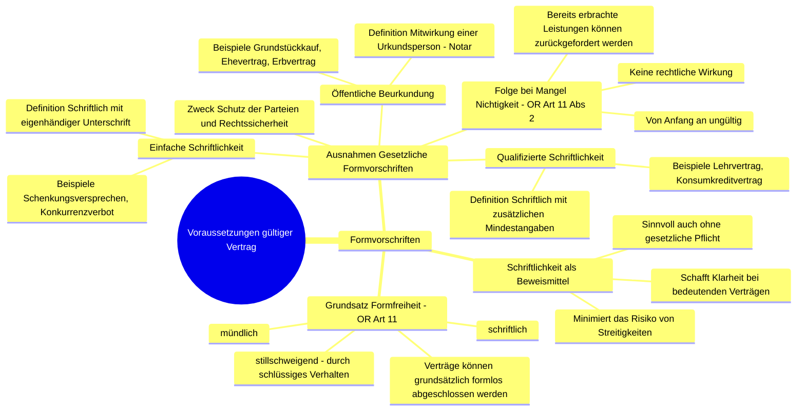

```mermaid
mindmap
  root((Voraussetzungen gültiger Vertrag))
    Formvorschriften
      Grundsatz Formfreiheit - OR Art 11
        Verträge können grundsätzlich formlos abgeschlossen werden
        mündlich
        schriftlich
        stillschweigend - durch schlüssiges Verhalten
      Ausnahmen Gesetzliche Formvorschriften
        Zweck Schutz der Parteien und Rechtssicherheit
        Einfache Schriftlichkeit
          Definition Schriftlich mit eigenhändiger Unterschrift
          Beispiele Schenkungsversprechen, Konkurrenzverbot
        Qualifizierte Schriftlichkeit
          Definition Schriftlich mit zusätzlichen Mindestangaben
          Beispiele Lehrvertrag, Konsumkreditvertrag
        Öffentliche Beurkundung
          Definition Mitwirkung einer Urkundsperson - Notar
          Beispiele Grundstückkauf, Ehevertrag, Erbvertrag
        Folge bei Mangel Nichtigkeit - OR Art 11 Abs 2
          Von Anfang an ungültig
          Keine rechtliche Wirkung
          Bereits erbrachte Leistungen können zurückgefordert werden
      Schriftlichkeit als Beweismittel
        Sinnvoll auch ohne gesetzliche Pflicht
        Schafft Klarheit bei bedeutenden Verträgen
        Minimiert das Risiko von Streitigkeiten
```
