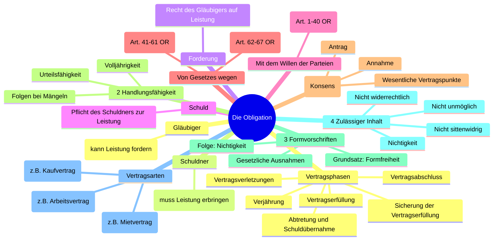

```mermaid
mindmap
  root((Die Obligation))
    Gläubiger
      Berechtigter (kann Leistung fordern)
    Schuldner
      Verpflichteter (muss Leistung erbringen)
    Forderung
      Recht des Gläubigers auf Leistung
    Schuld
      Pflicht des Schuldners zur Leistung
    Mit dem Willen der Parteien
        Durch Vertrag (Art. 1-40 OR)
    Von Gesetzes wegen
        Unerlaubte Handlung (Art. 41-61 OR)
        Ungerechtfertigte Bereicherung (Art. 62-67 OR)
    1 Einigung (Konsens)
        Antrag
        Annahme
        Wesentliche Vertragspunkte
    2 Handlungsfähigkeit
        Volljährigkeit
        Urteilsfähigkeit
        Folgen bei Mängeln
    3 Formvorschriften
        Grundsatz: Formfreiheit
        Gesetzliche Ausnahmen
        Folge: Nichtigkeit
    4 Zulässiger Inhalt
        Nicht unmöglich
        Nicht widerrechtlich
        Nicht sittenwidrig
        Nichtigkeit
    Vertragsarten
        Veräußerungsverträge (z.B. Kaufvertrag)
        Verträge auf Gebrauchüberlassung (z.B. Mietvertrag)
        Verträge auf Arbeitsleistung (z.B. Arbeitsvertrag)
    Vertragsphasen
        Vertragsabschluss
        Vertragserfüllung
        Vertragsverletzungen
        Sicherung der Vertragserfüllung
        Verjährung
        Abtretung und Schuldübernahme
```
