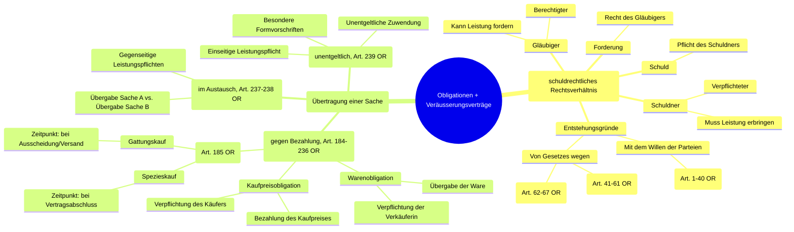

```mermaid
mindmap
  root((Obligationen + Veräusserungsverträge))
    Obligation (schuldrechtliches Rechtsverhältnis)
      Gläubiger
        Berechtigter
        Kann Leistung fordern
      Schuldner
        Verpflichteter
        Muss Leistung erbringen
      Forderung
        Recht des Gläubigers
      Schuld
        Pflicht des Schuldners
      Entstehungsgründe
        Mit dem Willen der Parteien
          Durch Vertrag (Art. 1-40 OR)
        Von Gesetzes wegen
          Unerlaubte Handlung (Art. 41-61 OR)
          Ungerechtfertigte Bereicherung (Art. 62-67 OR)
    Veräusserungsverträge (Übertragung einer Sache)
      Kaufvertrag (gegen Bezahlung, Art. 184-236 OR)
        Warenobligation
          Verpflichtung der Verkäuferin
          Übergabe der Ware
        Kaufpreisobligation
          Verpflichtung des Käufers
          Bezahlung des Kaufpreises
        Übergang von Nutzen und Gefahr (Art. 185 OR)
          Spezieskauf
            Zeitpunkt: bei Vertragsabschluss
          Gattungskauf
            Zeitpunkt: bei Ausscheidung/Versand
      Tauschvertrag (im Austausch, Art. 237-238 OR)
        Gegenseitige Leistungspflichten
        Übergabe Sache A vs. Übergabe Sache B
      Schenkung (unentgeltlich, Art. 239 OR)
        Einseitige Leistungspflicht
        Unentgeltliche Zuwendung
        Besondere Formvorschriften
```
