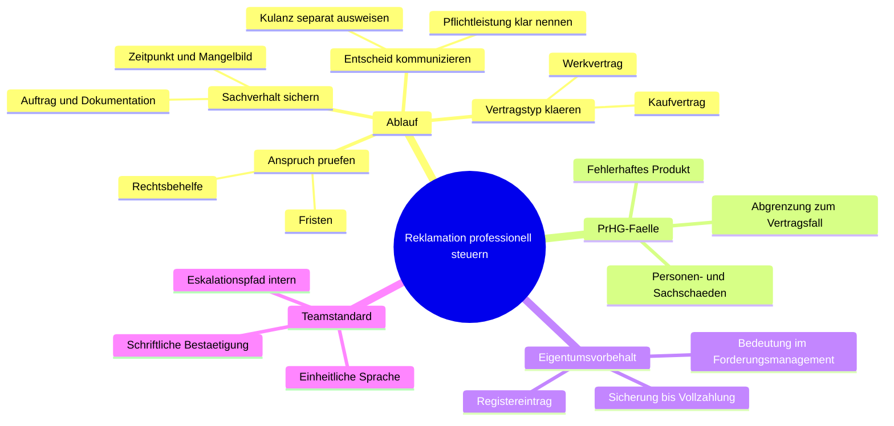

```mermaid
mindmap
  root((Reklamation professionell steuern))
    Ablauf
      Sachverhalt sichern
        Auftrag und Dokumentation
        Zeitpunkt und Mangelbild
      Vertragstyp klaeren
        Kaufvertrag
        Werkvertrag
      Anspruch pruefen
        Fristen
        Rechtsbehelfe
      Entscheid kommunizieren
        Pflichtleistung klar nennen
        Kulanz separat ausweisen
    PrHG-Faelle
      Fehlerhaftes Produkt
      Personen- und Sachschaeden
      Abgrenzung zum Vertragsfall
    Eigentumsvorbehalt
      Sicherung bis Vollzahlung
      Registereintrag
      Bedeutung im Forderungsmanagement
    Teamstandard
      Einheitliche Sprache
      Schriftliche Bestaetigung
      Eskalationspfad intern
```
