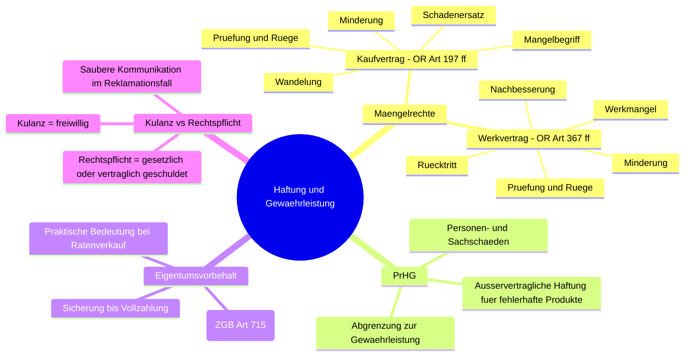

```mermaid
mindmap
  root((Haftung und Gewaehrleistung))
    Maengelrechte
      Kaufvertrag - OR Art 197 ff
        Mangelbegriff
        Pruefung und Ruege
        Minderung
        Wandelung
        Schadenersatz
      Werkvertrag - OR Art 367 ff
        Werkmangel
        Pruefung und Ruege
        Nachbesserung
        Minderung
        Ruecktritt
    PrHG
      Ausservertragliche Haftung fuer fehlerhafte Produkte
      Personen- und Sachschaeden
      Abgrenzung zur Gewaehrleistung
    Eigentumsvorbehalt
      Sicherung bis Vollzahlung
      Registereintrag (ZGB Art 715)
      Praktische Bedeutung bei Ratenverkauf
    Kulanz vs Rechtspflicht
      Kulanz = freiwillig
      Rechtspflicht = gesetzlich oder vertraglich geschuldet
      Saubere Kommunikation im Reklamationsfall
```
